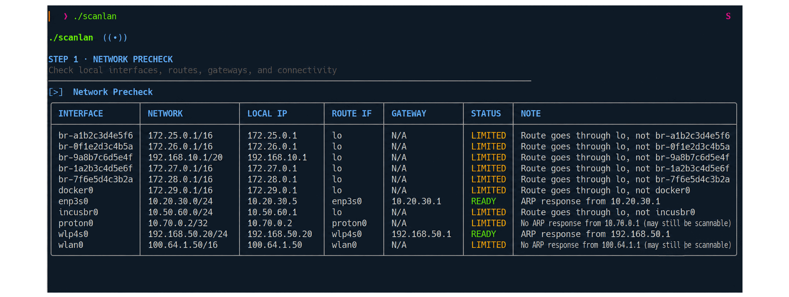
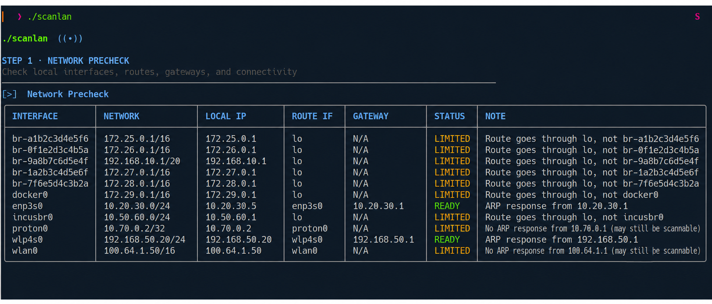
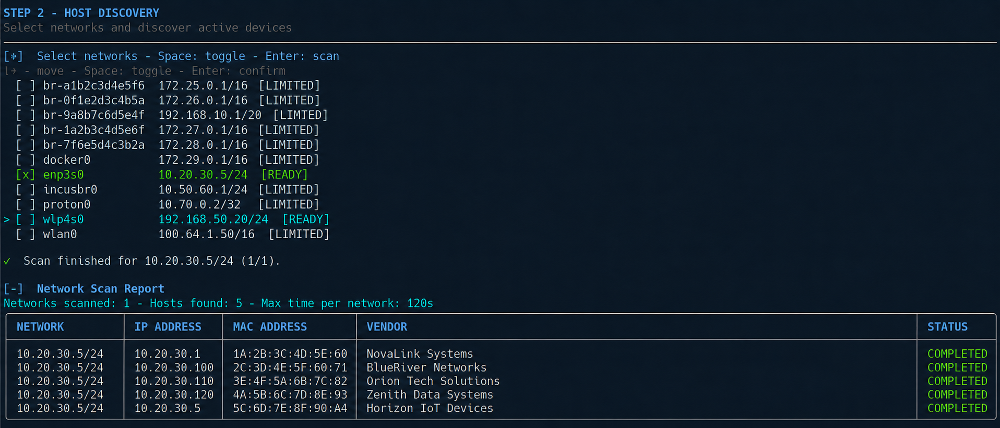
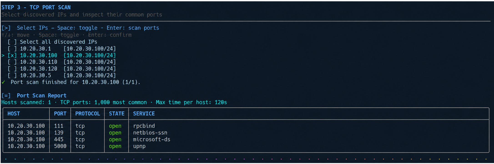

# ScanLAN

`scanlan` is an interactive Linux network scanner. It discovers active hosts on one or more local IPv4 networks and can scan the common TCP ports of selected hosts.



## Requirements

- Linux
- `nmap`
- `awk`
- `ip`
- `mktemp`
- `sort`
- `timeout`
- `sudo` access
- `arping` (optional)
- `curl` (installation only)

## Install

```bash
mkdir -p "$HOME/.local/bin"
curl -fsSL https://raw.githubusercontent.com/Mgldvd/scanlan/master/scanlan -o "$HOME/.local/bin/scanlan"
chmod +x "$HOME/.local/bin/scanlan"
scanlan --help
```

## Run

1. Start the interactive scanner.

```bash
scanlan
```



- Mark or unmark networks with Space.



- Start scanning the selected networks with Enter.

- Keep `Skip` selected to omit the port scan, or mark individual IP addresses or `Select all discovered IPs`.

- Select the 100 most common ports, the 1,000 most common ports, or all 65,535 TCP ports.



- Start the optional TCP port scans with Enter.

## How it works

1. Checks the required commands.
2. Detects active local IPv4 networks.
3. Runs a network precheck.
4. Marks `READY` networks by default.
5. Lets you select multiple networks.
6. Discovers active hosts with `nmap -sn`.
7. Shows live host counts and timeout countdowns.
8. Displays IP, MAC address, and vendor results.
9. Preselects `Skip` and lets you select multiple discovered IP addresses instead.
10. Lets you scan the 100 most common, 1,000 most common, or all 65,535 TCP ports on each selected IP.
11. Displays all open ports in one table.

The host discovery step does not scan ports. Port scanning only runs after you select discovered IP addresses.

## Network status

- `READY`: The route uses the expected interface and the ARP probe succeeded.
- `LIMITED`: The network may work, but the route or ARP check was inconclusive.
- `UNREACHABLE`: No route was found for the probe address.

Check the `NOTE` column for the exact precheck result.

## Commands

Scan a specific network.

```bash
scanlan 10.10.10.0/24
```

Choose the maximum scan time interactively.

```bash
scanlan --maxtime
```

Set the maximum scan time directly.

```bash
scanlan --maxtime 180
```

Set the maximum scan time and scan a specific network.

```bash
scanlan --maxtime 180 10.10.10.0/24
```

Show command help.

```bash
scanlan --help
```

Allowed maximum times: `60`, `120`, `180`, `240`, and `300` seconds. The default is `120` seconds per network or host.

## Notes

- A `/16` network can take much longer than a `/24` network.
- Partial host results are kept when a discovery scan reaches its timeout.
- MAC addresses are normally available only on the same Layer 2 network.
- VPN, Docker, and bridge networks may show `LIMITED` and still be scannable.
- Port scanning requires permission on the target network.

## Troubleshooting

- Install any command reported as missing.
- Check that the network interface is active when no networks appear.
- Select a smaller network or lower the maximum time when a scan takes too long.
- Check the precheck `NOTE` column when a network shows `LIMITED` or `UNREACHABLE`.
